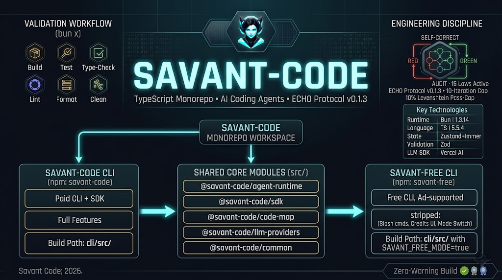

<!-- markdownlint-disable MD041 -->
<!-- markdownlint-disable MD033 -->
<div align="center">



**A terminal-native AI coding assistant that audits every change before it
touches your repo.**

Built with TypeScript/Bun, governed by the ECHO Protocol, and designed for
local-first use with Ollama.

[](https://www.typescriptlang.org/)[](https://bun.sh/)[](https://react.dev/)[](https://github.com/anomalyco/opentui)[](ECHO.md)[](LICENSE)[](CHANGELOG.md)

</div>

> **v0.0.16** — Checkpoint & Rewind: a persistent per-turn edit safety net with `/rewind`
> (restore code, conversation, both, or fork a session) built on a durable checkpoint store,
> plus a repo-wide quality sweep that hardened every execution surface — agent runtime
> (fail-closed tool-call streaming, Thinker cascade fixes), llm-providers + database
> (crash-proof init, rowid ordering, statement caching), SDK impl + common (OAuth
> rate-limit double-execution fix, zod `required` re-derivation), code-map, and the evals
> runner — with ECHO protocol enforcement (programmatic tool primitives, fail-closed step
> validation) and build hygiene (`bun run clean`, no orphan sourcemaps). v0.0.16's
> CommandCode provider, first-run onboarding, and synchronized release metadata carry
> forward.

---

## Get Started in 30 Seconds

```bash
# Install the CLI
npm install -g savant-code

# Run it. If Ollama is running, it will auto-detect and use it.
savant-code
```

_A terminal demo video is not yet available; the landing page and CLI source
links below describe the currently verified workflow._

No Ollama yet?

```bash
# macOS / Linux
curl -fsSL https://ollama.com/install.sh | sh
ollama serve

# Windows: https://ollama.com/download/windows
```

Then run `savant-code` again, or type `/health` inside the chat to verify the
connection.

If Ollama is not running, configure a hosted provider before sending a prompt:

```text
/provider opencode-go
```

You can also enter `/provider` to choose from the interactive picker. Paste the
key into the masked prompt; it is stored globally and is never added to chat
history. The default OpenCode Go key uses `OPENCODE_GO_API_KEY`; CommandCode uses
`COMMAND_CODE_API_KEY`. The key is persisted
at `C:\\Users\\<username>\\.savant-code\\credentials.json` on Windows or
`~/.savant-code/credentials.json` on macOS/Linux. Environment variables take
precedence over saved credentials.

```powershell
$env:OPENCODE_GO_API_KEY = "your-key"
savant-code
```

```cmd
set OPENCODE_GO_API_KEY=your-key
savant-code
```

```bash
export OPENCODE_GO_API_KEY=your-key
savant-code
```

Do not create a project-local `.env` file or edit `credentials.json` manually.

---

## Overview

Savant-Code is a TypeScript monorepo that builds and ships the terminal-native
AI coding assistant **Savant Code** and the public
[`@savant-code/sdk`](https://www.npmjs.com/package/@savant-code/sdk). The CLI
provides multi-agent orchestration, custom skills, MCP tool discovery, mode
switching (`EDIT` / `ANALYZE` / `SCAFFOLD`), and local-first Ollama support. The
SDK, agent runtime, multi-agent orchestration engine, tool layer, and LLM
provider shims are shared so both surfaces ship from one codebase.

The whole project ships under [ECHO Protocol v0.2.0](ECHO.md) — the same 15-law
agent discipline that governs the Savant ecosystem. Every change goes through
the RED → GREEN → AUDIT → SELF-CORRECT → COMPLETE Perfection Loop FSM, with a
hard 10-iteration cap and a 10% Levenshtein change-cap per pass.

---

## Key Technologies

| Layer           | Tech                              | Version                                           |
| --------------- | --------------------------------- | ------------------------------------------------- |
| Runtime         | Bun                               | 1.3.14 (engines `>=1.3.11`)                       |
| Language        | TypeScript                        | 5.5.4 (`strict: true`, `noImplicitReturns: true`) |
| TUI             | OpenTUI + React 19                | `@opentui/core` 0.2.2, `react` ^19.0.0            |
| State           | Zustand + Immer                   | zustand ^5.0.8, immer ^10.1.3                     |
| Validation      | Zod                               | ^4.2.1                                            |
| LLM SDK         | Vercel AI SDK                     | `ai` ^5.0.52 + `@ai-sdk/anthropic` 2.0.50         |
| MCP             | Model Context Protocol            | `@modelcontextprotocol/sdk` ^1.18.2               |
| Code parsing    | tree-sitter (WASM)                | `@vscode/tree-sitter-wasm` 0.1.4                  |
| HTTP / WS       | ws, node-fetch, custom SDK client | ws ^8.18.0                                        |
| Package manager | Bun workspaces (hoisted)          | `bunfig.toml` `[install] linker = "hoisted"`      |

---

## Features

### CLI (`@savant-code/cli`)

- **Multi-agent orchestration** — 9 specialized agents coordinate via ECHO
  Protocol: Detective finds issues, Forge implements, Verifier audits, Recorder
  manages FIDs, Thinker reasons, Scout explores, Researcher investigates, Scribe
  documents.
- **Thinker with sequential thinking** — the Thinker agent accumulates stacked
  reasoning steps via `sequentialthinking`, converges to a typed non-null
  `FinalArtifact` (status/synthesis/payload/metrics/thoughts), and never returns
  a null or empty result.
- **Native tool-call hardening** — fail-closed streaming boundary for
  incomplete/malformed/truncated tool calls; stale-fragment replacement for
  placeholder arguments; permissive coercion of stringified numbers/booleans
  before strict Zod validation.
- **Tool permission boundary** — strict allowlist-based tool provisioning via
  `filterToolSet`; restricted agents (Thinker, Scout) never receive parent-only
  tools; executor authorization unchanged.
- **`/init` command** — scaffolds
  `.agents/types/{agent-definition,tools,util-types}.ts` and a starter
  `knowledge.md`.
- **Slash commands** — `/new`, `/history`, `/bash`, `/goal`, `/loop`,
  `/feedback`, `/rewind`, `/theme:toggle`, `/login`, `/logout`, `/exit`, plus
  agent-specific commands.
- **Provider setup** — `/provider` opens an interactive dropdown picker showing
  all providers with ✓/✗ configuration status. Select a provider to enter its
  API key (masked input). Keys stored in local `credentials.json`.
- **Telemetry controls** — `/telemetry status|enable|disable` toggles remote
  analytics and error reporting. Remote analytics is enabled by default in the
  main CLI but remains user-disableable; local logs remain available when it is
  disabled. Contextual ads are separate: ads are disabled by default in the
  main CLI and can be controlled independently where available. Savant-Free is
  the separate ad-supported product surface.
- **`@filename` and `@AgentName` mentions** — file and agent mentions with
  inline autocomplete.
- **Bash mode** — `!command` or `/bash` to run shell commands inline (with
  confirmation).
- **Permission and sandbox controls** — `--permission-mode safe|prompt|unsafe`
  sets the startup policy, while `/permissions` (aliases `/sandbox` and
  `/safety`) shows or changes it during a session. `safe` denies risky tools;
  `prompt` currently also denies risky tools because interactive confirmations
  are not yet implemented, and `unsafe` allows them
  explicitly. Use `unsafe` only when you understand the command risk.
- **Goal loop** — `/goal` sets a goal condition; `/loop <cadence>` schedules
  recurring prompt execution (e.g., `/loop 5m check build status`). The loop
  scheduler manages cadence, run counts, and convergence detection.
- **Structured planning and review** — `/interview` turns an underspecified
  request into a structured specification, `/plan` creates an implementation
  plan, and `/review` opens a focused code-review workflow.
- **In-chat verification** — `/verify` runs the four supported core workspace
  typechecks, or target one with `/verify sdk`, `/verify common`,
  `/verify agent-runtime`, or `/verify cli`. `/diagnostics` reports local
  process/resource information.
- **Conversation utilities** — `/copy` (aliases `/copy-chat` and `/export`) copies
  the full conversation, while `/image` (aliases `/img` and `/attach`) attaches
  an image when the selected provider supports multimodal input.
- **Agent publishing** — `/publish` opens the agent publishing flow for
  templates with the required publisher metadata. It requires the Savant Code
  backend rather than direct-provider mode.
- **Mode switching** — `EDIT` / `ANALYZE` / `SCAFFOLD` execution-scope modes,
  togglable at runtime via UI.
- **Streaming & cancellation** — token-by-token SSE streaming with mid-stream
  cancellation, retry-with-backoff, and subagent streaming for parallel work.
- **Knowledge files** — project-level `knowledge.md` plus per-user home-dir
  knowledge, auto-loaded into agent context.
- **Skills** — OpenClaw-format `SKILL.md` files discovered at startup, schemas
  sent to the LLM, available as native tools.
- **MCP tools** — Model Context Protocol servers discovered at startup, schemas
  published to the LLM API.
- **Context compaction** — 4-layer progressive auto-compaction: L0 (summarize
  old turns), L1 (compress tool results), L2 (prune stale context), L3
  (aggressive reduction). Preserves critical context while reducing token usage.
- **Context window resolution** — gateway models (e.g. `opencode-go/mimo-v2.5`)
  resolve their real context length from the OpenRouter catalog at runtime.
- **Universal copy buttons** — hover-to-copy on code blocks, tool outputs, and
  file diffs throughout the TUI.
- **Gateway providers** — TokenRouter, NVIDIA NIM, OpenCode Go, CommandCode, and
  Cloudflare Workers AI via `@savant-code/llm-providers`.
- **Default model** — MiMo 2.5 via OpenCode Go (configurable via `/model`).
- **Theming** — light/dark toggle (`/theme:toggle`), Neon Slate aesthetic.
- **Sidebar folding** — right-sidebar sections and FID cards start collapsed
  for a compact first render; click to expand.
- **Full command surface** — the primary slash-command families are documented
  in the reference below; advanced commands remain available through the
  registry and autocomplete.
- **Checkpoint & Rewind** — one persistent checkpoint per user turn records the
  pre-edit content of every file first touched (including subagent writes) plus
  the conversation boundary; `/rewind` opens a picker to restore **code only**,
  **conversation only**, **both**, or **fork a new session** from an earlier
  turn — no git required. Retention is bounded to the most recent 20 turns,
  and terminal side effects are never rewound.

### SDK (`@savant-code/sdk`)

- **`SavantCodeClient` class** — single entry point for running agents from any
  Node.js / Bun / browser app.
- **Streaming events** — `handleEvent` callback receives `RunState` updates,
  tool calls, file diffs, and final output.
- **Custom agents** — pass `agentDefinitions: AgentDefinition[]` to override
  defaults.
- **Custom tools** — pass `customToolDefinitions` to extend the tool registry.
- **Cancellation** — `AbortSignal` propagates through subagent streams.
- **Checkpoint API** — the persistent checkpoint store (`openTurn`,
  `captureSnapshot`, `closeTurn`, `listTurns`, `restoreTurn`, `forkFrom`) is
  re-exported from the SDK, so hosts can checkpoint and rewind any run;
  `checkpointDir`/`checkpointTurnId` run options thread the turn boundary into
  subagent writes.

### Agent Runtime (`@savant-code/agent-runtime`)

- **LLM-agnostic** — calls any provider registered with
  `@savant-code/llm-providers` (OpenAI-compatible chat, Anthropic, etc.).
- **Multi-step loop** — model decides tool → tool executes → result fed back →
  repeat until `end_turn` or budget exhausted.
- **Tool registry** — built-in (`read_files`, `write_file`,
  `run_terminal_command`, `code_search`, `web_search`, `spawn_agents_inline`,
  …) + custom + MCP.
- **Cost aggregation** — per-call token counts and USD cost estimates surfaced
  in `RunState`.
- **Turn checkpoints** — the write-gate in `executeToolCall` captures
  pre-edit content before `write_file`/`str_replace`/`apply_patch` dispatch;
  subagent writes inherit the parent turn via spawn context.

### ECHO Protocol Integration

- **9 specialized agents** — Orchestrator, Detective, Forge, Verifier, Recorder,
  Thinker, Scout, Researcher, Scribe
- **FID-Bound Execution** — Code is never written until the FID converges
- **Perfection Loop FSM** — RED → GREEN → AUDIT → SELF-CORRECT → COMPLETE
- **Separation of Duties** — The agent that writes code cannot verify it
- **15 Laws** — 4 immutable process + 11 extended code laws

---

## Repo Map

<!-- markdownlint-disable MD013 MD060 -->

| Workspace                 | Package                      | Purpose                                                           |
| ------------------------- | ---------------------------- | ----------------------------------------------------------------- |
| `agents/`                 | `@savant-code/agents`        | Public agent definitions shipped with the CLI                     |
| `cli/`                    | `@savant-code/cli`           | CLI source — UI, commands, state, hooks, OpenTUI/React components |
| `common/`                 | `@savant-code/common`        | Shared types, tool definitions, utilities                         |
| `evals/`                  | `@savant-code/evals`         | ECHO-native benchmark v2 runner + legacy eval fixtures            |
| `savant-free/`            | `@savant-code/savant-free`   | Private/pre-release free/ad-supported variant; local binary + E2E support |
| `packages/agent-runtime/` | `@savant-code/agent-runtime` | Agent loop, tool executor, LLM API integration                    |
| `packages/code-map/`      | `@savant-code/code-map`      | tree-sitter code indexing, language detection                     |
| `packages/database/`      | `@savant-code/database`      | Database abstraction layer                                        |
| `packages/llm-providers/` | `@savant-code/llm-providers` | Public LLM provider shims                                         |
| `sdk/`                    | `@savant-code/sdk`           | Public SDK — `SavantCodeClient`, types, build + verify scripts    |
| `scripts/tmux/`           | `@savant-code/tmux`          | tmux CLI helpers used in interactive test runs                    |

<!-- markdownlint-enable MD013 MD060 -->

---

## Quick Start

### 1. Clone and Install

```bash
git clone https://github.com/savant0x/savant-code.git
cd savant-code
bun install
```

### 2. Run the CLI (development)

```bash
# Run the CLI in dev mode
bun run dev

# Or run with a specific permission mode
bun run dev -- --permission-mode safe
```

### 3. Build for Release

```bash
# Build the SDK
bun run build:sdk

# Build the CLI binary from the CLI workspace
bun run --cwd=cli build:binary
```

### 4. Use the SDK

```ts
import { SavantCodeClient } from '@savant-code/sdk'

const client = new SavantCodeClient({
  apiKey: process.env.SAVANT_CODE_API_KEY,
  cwd: '/path/to/your/project',
  onError: (err) => console.error('Savant-Code error:', err.message),
})

const result = await client.run({
  agent: 'savant',
  prompt: 'Add error handling to all API endpoints',
  handleEvent: (event) => console.log('Progress', event),
})
```

### 5. End-User Install

```bash
# npm
npm install -g savant-code
```

### 6. Use with local Ollama (zero API key)

If you have [Ollama](https://ollama.com/) installed and running, Savant Code
auto-detects it on first launch and routes inference to your local daemon — no
API key, no account, no prompts.

```bash
# Start Ollama in the background, then run the CLI
ollama serve
savant-code
```

Run `/health` inside the chat to verify the Ollama connection, available local
models, and current permission mode.

### Configure a hosted provider key

If Ollama is not running, Savant-Code needs a provider API key for the selected
gateway model. On the first run, enter:

```text
/provider
```

The key prompt is masked and stores the key globally in the Savant-Code config
`credentials.json`; it is not added to chat history. The default provider is
OpenCode Go (`OPENCODE_GO_API_KEY`). CommandCode uses `COMMAND_CODE_API_KEY`.
You can also choose `/provider tokenrouter`, `/provider nvidia`, or
`/provider commandcode`. Shell environment variables take precedence over stored
keys, so CI and managed environments can continue to configure providers without
using local persistence.

---

## CLI Commands

<!-- markdownlint-disable MD013 MD060 -->

| Command                           | What it does                     |
| --------------------------------- | -------------------------------- |
| `bun run dev`                     | Launch CLI in dev mode           |
| `bun run build:sdk`               | Build the SDK for npm publish    |
| `bun run --cwd=cli build:binary`  | Build the CLI binary from `cli/` |
| `bun run ci`                      | Build SDK and release artifacts  |
| `bun test`                        | Run the test suite               |
| `bun x tsc --noEmit`              | Type check                       |
| `bun x eslint . --max-warnings 0` | Lint                             |

<!-- markdownlint-enable MD013 MD060 -->

---

## Slash Command Reference

Commands can be entered with `/`; aliases are shown in parentheses. Availability
can differ in Savant-Free mode, which intentionally removes paid/backend-only
commands.

| Command | Purpose |
| --- | --- |
| `/help` (`/h`, `/?`) | Show command help and tips |
| `/new` (`/clear`, `/reset`) | Start a fresh chat; optional text starts the first prompt |
| `/history` (`/chats`) | Browse and resume previous conversations |
| `/copy` (`/export`) | Copy the complete conversation |
| `/interview` | Turn an idea into a structured specification |
| `/plan` | Create an implementation plan |
| `/review` | Review code changes |
| `/goal` (`/g`) | Iterate until a verifiable goal is satisfied |
| `/loop` (`/repeat`) | Run a prompt on a recurring cadence; use `stop` or `status` |
| `/verify` (`/typecheck`) | Run the four supported core workspace typechecks, all or one selected |
| `/permissions` (`/sandbox`, `/safety`) | View or set `safe`, `prompt`, or `unsafe` tool policy |
| `/rewind` (`/undo`, `/checkpoint`) | Restore a previous turn’s files and/or conversation |
| `/health` (`/status`, `/check`) | Check Ollama, provider mode, model, and permission status |
| `/diagnostics` (`/diag`, `/processes`) | Show local process and resource diagnostics |
| `/provider` | Configure a hosted provider key with masked input |
| `/model` | Select or switch the active hosted model |
| `/publish` | Publish agent templates through the Savant backend |
| `/feedback` (`/bug`, `/report`) | Open the feedback flow |
| `/telemetry` (`/analytics`) | View or change remote analytics consent |
| `/theme:toggle` | Switch between light and dark themes |
| `/bash` (`!`) | Run a shell command or enter Bash mode |
| `/image` (`/img`, `/attach`) | Attach an image for supported multimodal models |
| `/init` | Create starter agent types and `knowledge.md` |
| `/login` / `/logout` | Authenticate or end the current session |
| `/exit` (`/quit`, `/q`) | Quit the CLI |

Savant-Free additionally exposes free-session controls such as `/end-session`
and its model picker; paid/backend-only commands are filtered from that build.

---

## ECHO Protocol

This project ships with [ECHO Protocol v0.2.0](ECHO.md) — the single bootstrap
file for agent behavior.

### Core Principles

- **FID-Bound Execution** — Code is never written until the FID converges
- **Perfection Loop** — RED → GREEN → AUDIT → SELF-CORRECT → COMPLETE
- **Separation of Duties** — The agent that writes code cannot verify it
- **No Deferrals** — Every approved work item must be completed

### 15 Laws

4 immutable process laws (Read 0-EOF, Present Before Act, Verify Before Proceed,
Call-Graph Reachability) + 11 extended code laws. `strict: true` in TypeScript.

### Key Files

| File                     | Purpose                                           |
| ------------------------ | ------------------------------------------------- |
| `ECHO.md`                | The 15 Laws + Perfection Loop FSM + FID lifecycle |
| `ARCHITECTURE.md`        | Agent roster and tool restrictions                |
| `protocol.config.yaml`   | Build commands, quality bar, paths                |
| `dev/fids/`              | Feature Implementation Documents                  |
| `dev/session-summaries/` | Session audit trail                               |
| `dev/LEARNINGS.md`       | Cross-session lessons                             |

---

## Configuration

| What                         | Where                  | Format                                    |
| ---------------------------- | ---------------------- | ----------------------------------------- |
| ECHO Protocol runtime config | `protocol.config.yaml` | YAML — language, commands, quality limits |
| TypeScript base config       | `tsconfig.json`        | JSON — `strict: true`                     |
| ESLint config                | `eslint.config.js`     | Flat config                               |
| Bun config                   | `bunfig.toml`          | TOML — `linker: "hoisted"`                |

---

## Validation

```bash
# Build
bun run build:sdk && bun run ci

# Test
bun test

# Type check
bun x tsc --noEmit

# Lint
bun x eslint . --max-warnings 0

# Format
bun x prettier --write .
```

---

## Documentation

- [`ECHO.md`](ECHO.md) — The 15 Laws + Perfection Loop FSM
- [`ARCHITECTURE.md`](ARCHITECTURE.md) — Agent roster and tool restrictions
- [`protocol.config.yaml`](protocol.config.yaml) — Build commands, quality bar
- [`CHANGELOG.md`](CHANGELOG.md) — Release history
- [`docs/launch/landing/index.html`](docs/launch/landing/index.html) — Public
  landing page
- [`dev/LEARNINGS.md`](dev/LEARNINGS.md) — Cross-session lessons
- [`dev/session-summaries/`](dev/session-summaries/) — Session audit trail

---

## License

[Apache-2.0](LICENSE) — see [LICENSE](LICENSE) for full text.

---

_Savant-Code is the public TypeScript monorepo for the Savant-Code agent
framework._

**Savant** • 2026
