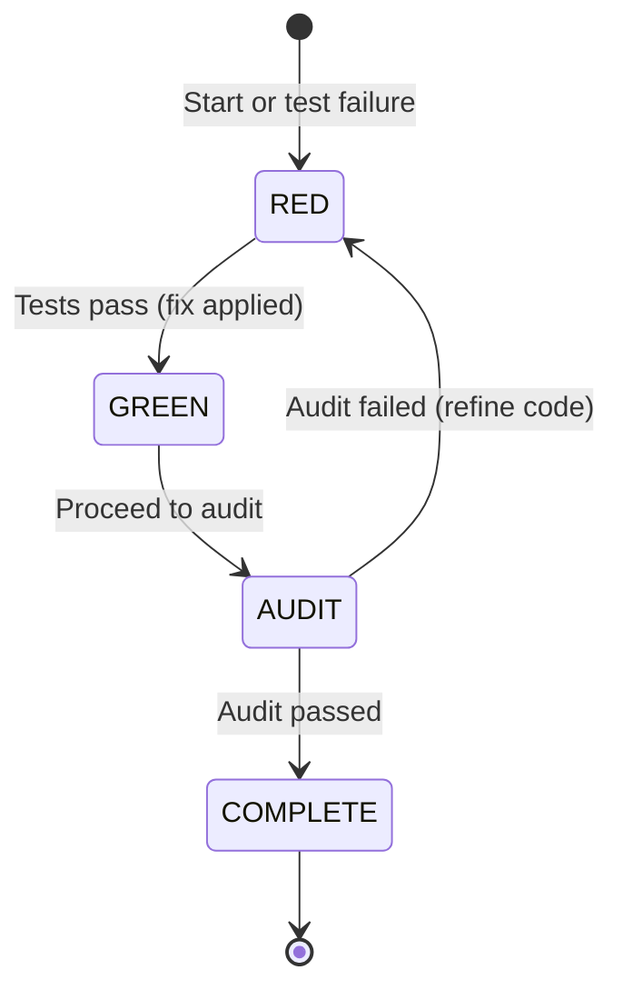

# Savant Perfection Loop System Design

**Summary:** We apply *loop engineering* principles to Savant’s multi-agent framework (9 agents including Orchestrator,
Detective, Forge, Verifier, etc.) under the “Perfection Loop” protocol (RED→GREEN→AUDIT→COMPLETE phases). Drawing on
Osmani, Greyling, and LangChain, we map loop components to each agent role and design a Rust/TypeScript harness. Key
elements include a stateful **PerfectionLoopPhase** FSM, a **SequentialThinkingServer** (Thinker) to coordinate agents,
robust handoffs with persistent loop state, circuit-breakers to halt runaway cycles, and a “double audit” (AI verifier +
static analyzers) in the AUDIT phase. The following document outlines the system architecture, data models, and
implementation roadmap.

---

## Loop Architecture Mapping

Loop engineering treats the agent workflow as a **recursive, automated cycle** rather than manual prompting. Greyling
articulates that a production loop is “a small system with six parts” (five capabilities + persistent memory). Savant’s
10-agent roster aligns with these components:

- **Automations (Scheduler):** The **Orchestrator** agent implements Greyling’s “heartbeat”. It schedules loop
  iterations (e.g. via cron or in-process timers) and triggers each cycle automatically. This corresponds to Osmani’s
  notion of automated discovery/triage.
- **Workspaces (Isolation):** Each agent run occurs in an isolated git **worktree**. Parallel Forge/Verifier processes
  use separate checkouts (or containers) so they don’t collide on the repo. The harness automatically cleans up these
  worktrees per Greyling’s guidance.
- **Project Knowledge (Skills):** Shared knowledge (coding conventions, APIs) is codified in a **Memory/KnowledgeBase**.
  For example, a `skills.md` or database of schema prevents agents from re-deriving project context each run. The
  **Detective** agent may manage this memory, providing context to others.
- **Connectors/Plugins:** All agents (via the Orchestrator) use a common tool interface (MCP plugins) to interact with
  real systems (e.g. GitHub, build servers, etc.). This maps to Osmani’s “plugins/connectors” and lets Savant agents act
  (open PRs, run CLI tests) rather than just suggest.
- **Sub-Agents (Maker/Checker):** Savant enforces a strict maker-checker pattern. One agent (e.g. **Forge**) generates
  code changes, and a separate **Verifier** agent (often with a “stronger” model or specialist logic) checks them
  against tests/specs. This prevents the generator from “grading its own homework,” as Greyling notes.
- **Persistent Memory (State):** The loop’s **state file** (e.g. `STATE.json` or database) answers “What are we working
  on? What happened last run?”. The **Thinker** (SequentialThinkingServer) maintains this FSM state
  (`PerfectionLoopPhase`, iteration count, logs) across agent calls. All agents read/write this shared state so no
  context is lost.

These loop components map to the RED/GREEN/AUDIT/COMPLETE FSM as follows:  

- **RED (Failure/Investigate):** When tests fail or issues are detected, the system enters RED. The Detective analyzes
  failures (stack traces, logs) and records them. Based on this analysis, Thinker updates `PerfectionLoopPhase = RED`
  and signals Forge to generate fixes. This embodies the “investigate” step.
- **GREEN (Fix & Verify):** After Forge proposes code changes, the Verifier (via the Thinker) runs the test suite.
  Passing tests transition the state to GREEN. (If tests still fail, the Thinker stays in RED to continue looping.) In
  Green, **Orchestrator** holds code confidently, preparing to audit.
- **AUDIT (Deep Verification):** On GREEN, the system enters AUDIT. Here, a multi-pronged verification occurs: the
  Verifier agent examines the solution’s correctness and coverage, while static analysis tools (“bashers”) check the
  code graph and security constraints. Only an independent check (not the Forge’s own say-so) can approve this step. If
  audit passes, phase transitions to COMPLETE; if not, Thinker drops back to RED for further fixes.
- **COMPLETE (Done):** All checks have passed. The loop exits (or pauses) until new tasks arrive. The Thinker marks
  completion and may emit a final report for human review.


*State machine for Savant’s Perfection Loop (RED→GREEN→AUDIT→COMPLETE).*  

Each arrow in the above FSM corresponds to transitions enforced by the Orchestrator and Thinker logic. For example,
*VERIFIER* driving tests from RED to GREEN, and *AUDITOR* driving from AUDIT to COMPLETE. This loop closely follows
Osmani’s pattern “investigate, implement, verify, repeat” with an independent verification at each cycle.

## Codebuff Transformation Plan

The existing Codebuff CLI (in `CodebuffAI/codebuff`) is a TypeScript monorepo with these key modules:

- `cli/`: Interactive TUI client and main entrypoint  
- `packages/agent-runtime/`: Core orchestration of prompts/tools  
- `packages/code-map/`: Source parsing and code-location helpers  
- `agents/`: Definitions of built-in AI agents and prompts  
- `sdk/`: JS/TS SDK for external use  
- `common/`: Shared types and utilities  

To integrate the Perfection Loop, we must adapt these modules:

1. **CLI Entry Points:** Extend the `cli/index.ts` to accept new mode flags (`--perfection-loop`, `--fid-bound`,
   `--hybrid`) and to invoke the loop harness instead of a one-shot agent run. For example, the `codebuff init` command
   (Day 4 launch) will spawn the Thinker server and begin scheduled iterations. We will *strip* or disable any purely
   interactive flows, and add *hybrid mode* options (see below).
2. **Orchestrator Logic:** Insert a new Orchestrator component (in `packages/agent-runtime` or a new `orchestrator/`
   folder) that implements the RED→GREEN→AUDIT cycle. This may reuse parts of the existing runtime (which already
   invokes agents and test runners), but must be extended to loop. It should handle state persistence (saving
   `PerfectionLoopPhase` and iteration counts) before/after each agent call.
3. **FID-Bound Execution:** We add support for *Function-ID–bounded* fixes. In practice, the CLI will parse a `--fid
   <identifier>` flag or an explicit pointer to a code location (e.g. file+function name). The Forge agent will then
   restrict edits to that scope. This likely means modifying the code-selection logic in `packages/code-map` and
   `agents/forge/`. We will also adjust the test invocation so only relevant tests (based on the code scope) run,
   passing context to the Verifier.
4. **Hybrid Mode:** Codebuff’s blog mentions “--max” unlocking a Gemini/Sonnet hybrid model. Hybrid Mode here likely
   means mixing open and proprietary models or mixing AI with deterministic transformations. Architecturally, we will
   allow the Forge and Verifier to use either open models (e.g. Llama, Gem2 Flash) or closed models (e.g. Sonnet) based
   on user config. This requires parameterizing the LLM provider in `packages/llm-providers/` and updating the CLI to
   accept `--mode hybrid`.
5. **Execution Flow Adjustments:** Remove any assumptions of a single-pass run. For example, Codebuff normally stops
   after one repair; instead, we will loop until Thinker signals COMPLETE. We must embed the circuit-breaker checks
   (below) at loop boundaries, so that after each Forge/Verifier invocation the system may break out to human review if
   needed.
6. **State and Logging:** Codebuff already has minimal state (e.g. `codebuff.json`); we will introduce a structured
   `LoopState` persisted between runs (in Rust side or a `state.json`). The CLI should load/update this state.
7. **Testing and Audit Hooks:** The CLI’s testing routine (in `cli` or `agent-runtime`) must now feed results to the
   Thinker. We may extract existing test invocation (`npm test` or `cargo test`) into a callable function so that the
   Orchestrator can interpret pass/fail and reroute the flow. Similarly, we will embed calls to static analyzers (e.g.
   `bun run lint`, `cargo clippy`) in the AUDIT phase.

In summary, **modules to strip/extend**: disable the legacy one-shot handler in `cli/`; modify `packages/agent-runtime`
to include loop control; extend `code-map`, `llm-providers`, and agent prompts for FID/Hybrid modes; and add new
orchestrator, circuit-breaker, and audit subsystems.

## State Management & Handoffs

We define a shared state and a coordinator to preserve context across agents:

- **PerfectionLoopPhase FSM:** Define in Rust and TypeScript as:  
  ```rust
  // Rust
  #[derive(Debug, Clone, Copy, PartialEq, Eq)]
  enum PerfectionLoopPhase { Red, Green, Audit, Complete }
  struct LoopState {
      phase: PerfectionLoopPhase,
      iteration: u64,
      last_error: Option<String>,
      history: Vec<String>, // e.g. commit hashes or error messages
  }
  ```  
  ```typescript
  // TypeScript
  type PerfectionLoopPhase = "Red" | "Green" | "Audit" | "Complete";
  interface LoopState {
      phase: PerfectionLoopPhase;
      iteration: number;
      lastError?: string;
      history: string[];  // e.g. list of error IDs or code diffs
  }
  ```  
  This state lives in a durable store (e.g. a JSON file or database). It is loaded at loop start and updated after each
agent action.

- **SequentialThinkingServer (Thinker):** A lightweight service (e.g. a Rust HTTP/gRPC server or a long-running TS
  process) holds `LoopState` in memory. Agents send requests to Thinker to report results or ask for next steps. For
  instance, after Forge finishes a code edit, it sends `POST /report-code?commit=XYZ`, and Thinker updates state to
  `phase = Green` or stays in `Red`. Thinker’s API can enforce circuit-breakers before returning “continue” or “halt” to
  Orchestrator.

- **Sequence Diagram:** The typical agent interaction is:  

  ```mermaid
  sequenceDiagram
    participant O as Orchestrator
    participant D as Detective
    participant F as Forge
    participant V as Verifier
    participant T as Thinker

    O->>D: Analyze codebase (discover tasks)
    D->>T: Report identified issues (phase=Red)
    T->>F: Instruct code generation (phase=Red→Green)
    F->>T: Return with proposed patch
    T->>V: Trigger tests on patch (phase=Green)
    V->>T: Send test result
    alt Tests Passed
        T->>V: Trigger audit checks (phase=Audit)
        V->>T: Send audit result
        alt Audit Passed
            T->>O: Report success (phase=Complete)
        else Audit Failed
            T->>O: Report findings (phase→Red)
        end
    else Tests Failed
        T->>O: Request rework (remain in Red)
    end
  ```

  Each arrow is a context-ful API call. For example, after tests, Verifier posts results and `Thinker` transitions the
state. This sequence ensures **no context is lost**: each agent’s output (errors, diffs) is appended to
`LoopState.history` before moving on.

- **Data Handoffs:** Between agents, the Thinker serializes the relevant context. For example, when transitioning
  RED→GREEN, the Thinker may include in its instruction the specific function or test suite to re-run. We may define a
  common message format like:
  ```typescript
  interface AgentMessage {
      phase: PerfectionLoopPhase;
      iteration: number;
      payload: any;  // e.g. errors list, code diff, test summary
  }
  ```
  This is passed via HTTP or message queue. By embedding `phase` and `iteration`, we ensure agents always know the
current loop context. Persistent memory (e.g. a `STATE.json` checked into the repo or a database) guarantees that if the
orchestrator or server restarts, the loop can resume where it left off.

## Circuit Breaker Implementation

To prevent infinite loops, we implement **circuit-breaker rules** that analyze each iteration’s results:

- **Levenshtein Cap (10% rule):** After each code edit, compute the Levenshtein distance between the previous and
  current code version. If the change exceeds 10% of the file’s length, trigger the breaker. (This avoids wildly
  oscillating edits.)
- **Repetition/Convergence:** Track recent diffs in `LoopState.history`. If the same failure or similar code diff
  repeats *N* times, or if diffs converge below a minimal threshold (i.e. no real change), trip the breaker. This
  detects oscillation or stagnation.
- **Token/Iteration Limits:** Enforce a max iteration count or API token budget per loop. Beyond that, the Thinker
  returns an “escalate” signal.

These checks run at the **start of each iteration**. A simplified flowchart:

```mermaid
flowchart LR
    Start(["Begin Iteration"]) --> ComputeDiff{Compute code diff (Levenshtein %)}
    ComputeDiff -- >10% --> Trip[Trip Circuit-Breaker]
    ComputeDiff -- <=10% --> CheckOsc{Repeated/Oscillating?}
    CheckOsc -- Yes --> Trip
    CheckOsc -- No --> CheckLimit{Max attempts?}
    CheckLimit -- Yes --> Trip
    CheckLimit -- No --> Continue["Proceed with loop"]
```

If `Trip` is reached, the loop exits to **human review** instead of retrying. We implement this in a `CircuitBreaker`
module (Rust/TS) that inspects `LoopState.history`. For example, in Rust:

```rust
struct CircuitBreaker {
    max_diff: f64,           // e.g. 0.10
    max_repeats: usize,      // e.g. 3
    max_iterations: usize,   // e.g. 20
}

impl CircuitBreaker {
    fn check(&self, state: &LoopState, new_code: &str) -> bool {
        // Compute Levenshtein percent change:
        let last_code = /* retrieve from state.history */;
        let diff = levenshtein(&last_code, new_code) as f64 / last_code.len() as f64;
        if diff > self.max_diff || state.iteration >= self.max_iterations {
            return false; // trip circuit
        }
        // Additional logic for repeated diffs...
        true // safe to continue
    }
}
```

In practice, we also scaffold a ledger (inspired by Greyling’s `loop-ledger.json`) to record consecutive failures.
Before each retry, Orchestrator invokes this checker. On error, Thinker transitions to an **ESCALATE** state, triggering
alerts. This ensures we **break** any runaway fix loops.

## Double Audit Technical Spec

During the AUDIT phase, we enforce **dual verification** before completing the loop:

- **AI Verifier Agent:** A dedicated Verifier model (possibly a stronger LLM) reviews the code. It performs **call-graph
  analysis** by parsing the code AST and ensuring that all functions/classes are reachable from entry points. It also
  checks *business rules* captured in memory (e.g. security patterns, isolation). Its output is an `AuditReport`
  structure, e.g.:
  ```typescript
  interface AuditReport {
      verdict: "pass" | "fail";
      unreachableFunctions: string[];  // unused code detected
      disallowedCalls: string[];      // e.g. dynamic eval or unsafe I/O
      callGraphCoverage: number;      // 0–100%
      notes: string;
  }
  ```
  If any `verdict` is `"fail"`, it reports errors back to Thinker.

- **Static Analysis Tools:** In parallel, we run **traditional analyzers**. For Rust/TypeScript, this might include
  `cargo check`, `clippy`, ESLint, type-checkers, and domain-specific linters. These are shell-invoked from the CLI.
  Their findings (errors, warnings) form a `StaticReport`. We require **isolation**: e.g., ensure no forbidden syscalls
  or library calls are introduced. A sample report type:
  ```typescript
  interface StaticReport {
      success: boolean;
      errors: string[];
      warnings: string[];
  }
  ```

- **Enforcement:** Thinker only permits progression to COMPLETE if *both* the AI Verifier’s `AuditReport.verdict` is
  pass *and* the static tools `success` is true. Any issues (e.g. unreachable code, style violations, security flags)
  cause Thinker to loop back to RED for fixes. This double-layer audit provides evidence that the code is robust,
  meeting Osmani’s “quality checks” standard before shipping.

Finally, if **both checks pass**, Thinker marks the loop as COMPLETE and outputs a final summary (the “verdict”). This
architecture ensures all AI-generated code is cross-validated by independent methods (agentic and deterministic),
embodying Greyling’s and Osmani’s emphasis on independent verification.

---

**Sources:** The above design applies loop engineering concepts from Osmani’s and Greyling’s essays and LangChain’s
multi-loop pattern to Savant’s agents and state machine.  Codebuff’s repository structure informs the module
transformation plan. All architectural decisions are grounded in these references and the supplied Savant constraints.
